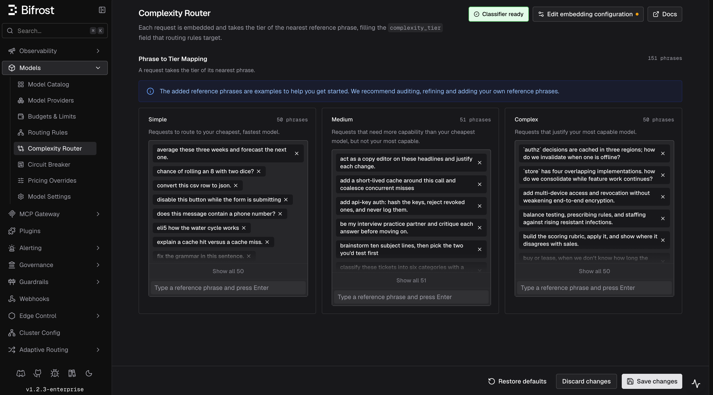
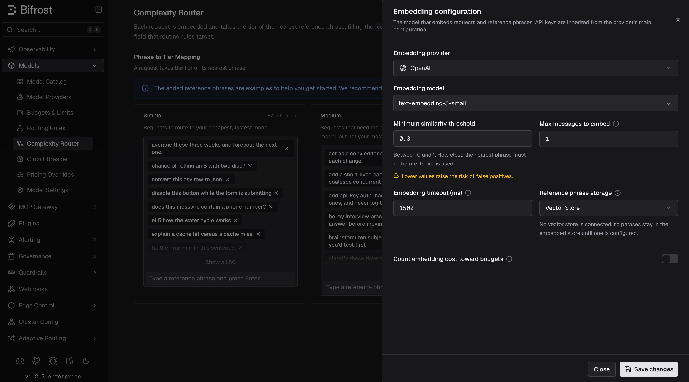

## Overview

The Complexity Router embeds each incoming request and assigns it the tier of its nearest **reference phrase**: **Simple**, **Medium**, or **Complex**. The result is exposed as a flat string variable (`complexity_tier`) in Bifrost's CEL routing engine, so you can write routing rules like:

```cel
complexity_tier == "COMPLEX"
complexity_tier in ["MEDIUM", "COMPLEX"]
```

This lets you route simple greetings to a fast, cheap model and deep reasoning tasks to a frontier model automatically, with no changes to your application code.

Classification runs only when a routing rule actually references `complexity_tier`, so requests that never touch a complexity rule pay no embedding cost. When classification is unavailable or the request resembles no reference phrase closely enough, Bifrost leaves `complexity_tier` unknown and keeps the request on its existing routing path instead of guessing.

<Note>
Complexity classification is **semantic** (embedding-based). The older lexical keyword scorer is retired. See [Lexical keyword classifier (retired)](#lexical-keyword-classifier-retired) for details and migration guidance.
</Note>



---

## How it works

1. **Extract.** Bifrost takes the latest user message (or the last `message_history_count` user messages, joined oldest-first) as the text to classify. System prompts and assistant replies are never embedded.
2. **Embed.** The text is embedded with your configured embedding provider and model, inline on the request path, bounded by `timeout` (default 1.5s).
3. **Match.** The embedding is compared against the stored reference-phrase embeddings in the vector store. The request takes the tier of the nearest phrase.
4. **Route.** The tier is published as `complexity_tier` for CEL routing rules. The matched phrase and similarity are recorded in the routing decision logs, so every decision is auditable.

If the nearest phrase scores below `min_similarity`, no tier is published. At `0` (the default), Bifrost accepts the nearest eligible match; a positive value makes the classifier abstain on weak matches. If the embedding call fails or times out, no tier is published either; in both cases the request falls through to your normal routing path rather than being blocked.

### Reference phrases

Reference phrases are example requests you label with a tier. The classifier's entire knowledge of "simple" vs "complex" comes from them. Bifrost ships **150 default phrases (50 per tier)** balanced across use cases (coding, math, writing, knowledge, conversation, extraction, translation, agentic) and writing styles, so the classifier learns *requested work* rather than subject matter or verbosity.

<Tip>
The defaults are examples to get you started. Audit them, refine them, and add phrases drawn from the prompts your users actually send. A handful of domain-specific phrases per tier usually improves routing more than any other tuning.
</Tip>

When writing your own phrases:

- **Each phrase's tier must be derivable from its own text.** "Summarize these notes" is fine; "yes, go with option 2" has no defensible tier on its own.
- **Keep phrases short and prototypical.** A long, hyper-specific phrase mostly matches near-identical requests.
- **Balance surface form across tiers.** If most Complex phrases are questions, every question routes to Complex. Mix questions, imperatives, terse and detailed phrasing in every tier.

With semantic classification configured, every tier must contain at least one phrase and each phrase must be 2,000 characters or fewer. Bifrost also rejects the same normalized phrase in more than one tier when it saves or loads the configuration.

### Choosing how much conversation to embed

`message_history_count` (default `1`) controls how many recent user messages are joined into the embedded text. Raising it lets a short follow-up like "and make it faster" inherit the intent of earlier turns, at the cost of diluting the latest message and embedding more tokens per request. Requests with fewer available turns embed what they have.

---

## Configuration

Semantic classification requires an embedding provider and model. The provider must have an enabled key in **Model Providers**. The UI warns you if the saved provider has no usable key.

<Tabs group="complexity-config">
<Tab title="Web UI">

Navigate to **Complexity Router** in the sidebar.

- **Phrase to Tier Mapping**: add a phrase by typing it and pressing **Enter** in a tier's input; remove one with the × on its chip. Counts are shown per tier.
- **Edit embedding configuration**: opens the embedding sheet (provider, model, similarity floor, history window, timeout, budgets, and phrase storage: **Embedded** keeps phrase vectors in Bifrost's own memory; **Vector Store** keeps them in the configured vector store so they survive restarts, falling back to Embedded when none is available).
- The **Classifier status** badge in the header shows whether the classifier is ready to serve (see [Classifier status and warmup](#classifier-status-and-warmup)).
- Click **Save changes** to apply (hot-reloaded, no restart), **Discard changes** to revert unsaved edits, or **Restore defaults** to restore the built-in reference phrases. Restore defaults keeps the embedding configuration.



</Tab>
<Tab title="API">

```bash
# Get current configuration
curl http://localhost:8080/api/governance/complexity-analyzer-config

# Update embedding configuration and reference phrases
curl -X PUT http://localhost:8080/api/governance/complexity-analyzer-config \
  -H "Content-Type: application/json" \
  -d '{
    "tier_boundaries": {
      "simple_medium": 0.2,
      "medium_complex": 0.4
    },
    "semantic": {
      "provider": "openai",
      "embedding_model": "text-embedding-3-small",
      "timeout": "1.5s",
      "min_similarity": 0,
      "message_history_count": 1,
      "count_toward_budgets": false,
      "vector_store": "embedded"
    },
    "keywords": {
      "simple_keywords": ["what is a mutex?", "fix the grammar in this sentence."],
      "medium_keywords": ["add api-key auth: hash the keys, reject revoked ones, and never log them."],
      "complex_keywords": ["balance testing, prescribing rules, and staffing against rising resistant infections."]
    }
  }'

# Check classifier status
curl http://localhost:8080/api/governance/complexity-analyzer-status

# Restore built-in reference phrases (embedding configuration is preserved)
curl -X POST http://localhost:8080/api/governance/complexity-analyzer-config/reset
```

Reference-phrase lists are stored in the existing `keywords` fields (`simple_keywords`, `medium_keywords`, `complex_keywords`). They now hold whole example phrases rather than scoring keywords.

</Tab>
<Tab title="config.json">

```json
{
  "governance": {
    "complexity_analyzer_config": {
      "tier_boundaries": {
        "simple_medium": 0.2,
        "medium_complex": 0.4
      },
      "semantic": {
        "provider": "openai",
        "embedding_model": "text-embedding-3-small",
        "timeout": "1.5s",
        "min_similarity": 0,
        "message_history_count": 1,
        "count_toward_budgets": false,
        "vector_store": "embedded"
      },
      "keywords": {
        "simple_keywords": ["what is a mutex?", "fix the grammar in this sentence."],
        "medium_keywords": ["add api-key auth: hash the keys, reject revoked ones, and never log them."],
        "complex_keywords": ["balance testing, prescribing rules, and staffing against rising resistant infections."]
      }
    }
  }
}
```

| Field | Type | Default | Description |
|---|---|---|---|
| `semantic.provider` | string | Required | Provider used for embedding calls; must have an enabled key |
| `semantic.embedding_model` | string | Required | Embedding model (e.g. `text-embedding-3-small`) |
| `semantic.timeout` | duration | `1.5s` | Ceiling on the inline embedding call; exceeding it skips tier routing for that request |
| `semantic.min_similarity` | number | `0` | Similarity floor. Below it no tier is published. `0` accepts the nearest eligible match |
| `semantic.message_history_count` | integer | `1` | Number of recent user messages joined into the embedded text |
| `semantic.count_toward_budgets` | boolean | `false` | Count embedding usage toward virtual-key budgets |
| `semantic.vector_store` | string | `embedded` | `embedded` uses Bifrost's built-in in-memory store and re-embeds phrases on restart. `vector_store` uses the configured top-level `vector_store`; if none is configured, it safely uses Embedded instead. |
| `tier_boundaries` | object | `0.2` / `0.4` | Legacy fields that remain required for API/config compatibility but do not affect semantic routing |
| `keywords.simple_keywords` | string[] | 50 built-in phrases | Reference phrases for the Simple tier |
| `keywords.medium_keywords` | string[] | 50 built-in phrases | Reference phrases for the Medium tier |
| `keywords.complex_keywords` | string[] | 50 built-in phrases | Reference phrases for the Complex tier |

<Note>
`min_similarity` is compared against the vector store backend's own similarity scale, which is not identical across backends: chromem, Qdrant, Pinecone, and Redis report raw cosine similarity, while Weaviate reports certainty ((cosine+1)/2). Retune the floor when switching backends.
</Note>

<Note>
When using Pinecone, the configured index dimension must match the embedding model's output dimension. Pinecone namespaces do not have independent dimensions, so changing to a model with a different dimension requires a separate Pinecone index and an updated `index_host`. Qdrant, Weaviate, and Redis create dimension-specific namespaces automatically.
</Note>

</Tab>
</Tabs>

---

## Classifier status and warmup

Reference phrases are embedded in the background (**warmup**) whenever the configuration changes. Bifrost detects the embedding dimension automatically. Within a running process, unchanged phrase vectors are reused; changing provider or model re-embeds every phrase.

The badge in the UI header and `GET /api/governance/complexity-analyzer-status` report:

| State | Meaning |
|---|---|
| `disabled` | No semantic embedding configuration; no tier is ever published |
| `warming` | Reference phrases are being embedded (`loaded` / `total` tracks progress). If `serving_previous` is true, the previous generation continues routing requests. |
| `ready` | The classifier is serving the current configuration |
| `failed` | The desired configuration failed to warm. When `serving_previous` is true, the previous generation keeps serving while you fix the problem |

The status response never contains phrases, embeddings, or provider secrets.

---

## Routing with `complexity_tier`

Once the classifier has a serving generation, use `complexity_tier` as a variable in any CEL routing rule expression. Bifrost evaluates it as a plain string.

`complexity_tier` is not a special standalone rule type. In the Routing Rules builder, it behaves like any other field, so you can combine it with headers, request type, team/customer scope, budgets, and other predicates in the same rule or nested rule group.

<Note>
Complexity Router only exposes `complexity_tier`; it does not create rules automatically. Add rules for the tiers you want to route. For deterministic three-tier routing, create rules for Simple, Medium, and Complex.
</Note>

### Available operators

| Operator | CEL syntax | Example |
|---|---|---|
| Equal | `==` | `complexity_tier == "COMPLEX"` |
| Not equal | `!=` | `complexity_tier != "SIMPLE"` |
| In list | `in` | `complexity_tier in ["MEDIUM", "COMPLEX"]` |
| Not in list | `!(x in [...])` | `!(complexity_tier in ["SIMPLE", "MEDIUM"])` |


### Combining with other rule conditions

You can mix complexity with any other routing condition the CEL builder supports:

```cel
headers["x-tier"] == "premium" && complexity_tier == "COMPLEX"
headers["x-region"] == "us-east" && complexity_tier in ["MEDIUM", "COMPLEX"]
request_type == "chat_completion" && complexity_tier != "SIMPLE"
team_name == "ml-research" && headers["x-env"] == "prod" && complexity_tier == "COMPLEX"
```

### Setting up a complexity-based routing rule

The best first rollout is usually a single **Complex** rule. It is easy to validate, has the smallest blast radius, and leaves Simple and Medium traffic on your existing routing path.

1. Go to **Routing Rules** in the sidebar.
2. Create a new rule and open the CEL builder.
3. Add a condition: field = **Complexity Tier**, operator = **=**, value = **Complex**.
4. Set the target provider and model to your strongest model.
5. Save and enable the rule.

Once you are happy with the classifications, add complementary rules for Simple and Medium if you want a full tier-based routing ladder.

### Use case examples

#### Start with a Complex carve-out

Route only frontier-worthy requests to your strongest model and let everything else keep using your existing routing:

```json
{
  "id": "complexity-complex",
  "name": "Complex → Frontier model",
  "enabled": true,
  "cel_expression": "complexity_tier == \"COMPLEX\"",
  "targets": [{ "provider": "anthropic", "model": "claude-opus-4-5", "weight": 1 }],
  "scope": "global",
  "priority": 0
}
```

#### Full three-tier ladder

Route every tier explicitly when you want deterministic model selection across the full spectrum:

```json
[
  {
    "id": "complexity-simple",
    "name": "Simple → Fast model",
    "enabled": true,
    "cel_expression": "complexity_tier == \"SIMPLE\"",
    "targets": [{ "provider": "groq", "model": "llama-3.1-8b-instant", "weight": 1 }],
    "scope": "global",
    "priority": 0
  },
  {
    "id": "complexity-medium",
    "name": "Medium → Balanced model",
    "enabled": true,
    "cel_expression": "complexity_tier == \"MEDIUM\"",
    "targets": [{ "provider": "openai", "model": "gpt-4o-mini", "weight": 1 }],
    "scope": "global",
    "priority": 1
  },
  {
    "id": "complexity-complex",
    "name": "Complex → Frontier model",
    "enabled": true,
    "cel_expression": "complexity_tier == \"COMPLEX\"",
    "targets": [{ "provider": "anthropic", "model": "claude-opus-4-5", "weight": 1 }],
    "scope": "global",
    "priority": 2
  }
]
```

#### Roll out to one team first

Test complexity routing with a single team before enabling it globally:

```json
{
  "id": "team-complex-pilot",
  "name": "Team pilot - complex route",
  "enabled": true,
  "cel_expression": "complexity_tier == \"COMPLEX\"",
  "targets": [{ "provider": "anthropic", "model": "claude-opus-4-5", "weight": 1 }],
  "scope": "team",
  "scope_id": "team-uuid-456",
  "priority": 0
}
```

---

## Observability

When a routing rule references `complexity_tier`, the classification outcome is recorded as structured fields on the request log:

| Field | Values | Meaning |
|---|---|---|
| `complexity_tier` | `SIMPLE`, `MEDIUM`, `COMPLEX` | The tier the request was classified into |
| `complexity_mechanism` | `semantic`, `skipped` | How the tier was produced. `semantic` means an embedding match produced the tier; `skipped` means a rule demanded a tier but classification produced none (classifier not configured or not ready, unsupported input, embedding failure/timeout, or a match below `min_similarity`) |
| `complexity_score` | 0.0 – 1.0 | The similarity score of the nearest reference phrase |

The routing decision logs also record the matched reference phrase alongside the tier and similarity, so you can tell a genuine match from an accidental one. Long phrases are truncated to 120 characters in the log line.

For example, a successful match is recorded as:

```text
Semantic complexity: tier=MEDIUM similarity=0.62 matched="produce a customer-facing incident summary from an already established cause and remediation."
```

These fields are only set when a routing rule actually referenced `complexity_tier`; requests that never touched a complexity rule carry no complexity fields.

### In the log explorer

The log detail view shows **Complexity Tier** (as a colored badge), **Complexity Mechanism**, and **Complexity Score** in the request overview. The logs filter sidebar can filter by **Complexity Tier** and **Complexity Mechanism**, so you can audit how traffic is being distributed and spot mis-classifications to tune your phrase lists or similarity floor. The same filters are available on the logs API as comma-separated query parameters:

```bash
curl "http://localhost:8080/api/logs?complexity_tiers=COMPLEX&complexity_mechanisms=semantic"
```

<Note>
The raw `complexity_score` is displayed but not filterable; tier and mechanism are the supported filter dimensions. The mechanism filter offers `semantic` and `skipped`. Legacy `REASONING` tiers remain available in the logs filter.
</Note>

### In telemetry

The tier and mechanism are also emitted as the span attributes `bifrost.complexity_tier` and `bifrost.complexity_mechanism`, and as low-cardinality labels on Prometheus metrics. The raw score is deliberately excluded from metrics (unbounded cardinality). It lives only in the request logs.

Semantic routing's own embedding overhead is tracked separately with two Prometheus counters, labeled by the embedding provider, model, and `phase` (`request` classification vs `warmup` exemplar embedding):

- `bifrost_routing_embedding_requests_total`
- `bifrost_routing_embedding_cost_total` (USD; recorded whether or not `count_toward_budgets` is set)

See [Telemetry](../telemetry) and [Prometheus](../observability/prometheus) for the full attribute and label reference.

---

## Troubleshooting

### No tier is ever published (everything is `skipped`)

The most common cause is that semantic classification is not configured or not ready. Check the classifier status badge or `GET /api/governance/complexity-analyzer-status`:

- `disabled`: set an embedding provider and model, and make sure the provider has an enabled key.
- `warming`: warmup is embedding the reference phrases. If `serving_previous` is true, the last good generation remains available while it runs.
- `failed`: check server logs for the provider or vector-store failure. If `serving_previous` is true, the last good generation is still serving while you fix the configuration.

Also verify a routing rule actually references `complexity_tier`; classification runs lazily and never runs otherwise.

### Rule not matching when complexity_tier is set

If the routing rule uses `complexity_tier` and the request is not matching, make sure the latest user message contains analyzable user text. A system prompt by itself is not enough. The classifier needs a text-bearing user prompt.

If classification is unavailable for a request (unsupported input, mixed-modal content, embedding failure, timeout, or a match below `min_similarity`), the complexity-dependent rule does not match and evaluation falls through to the next rule. This is intentional: complexity rules silently degrade rather than blocking requests.

### Which request types are supported

Complexity routing currently runs only for **text-bearing** request families. Supported inputs include:

- Chat Completions and other messages-style requests with text-only user content
- Text Completions requests using `prompt`
- Responses API requests using text-only `input`
- Anthropic Messages, Bedrock Converse, and Gemini `contents` / `systemInstruction` shapes when they carry text-only user input

It does **not** run for:

- Image generation, embeddings, rerank, OCR, audio/speech/transcription, video, or count-tokens requests
- Chat or Responses requests where user content mixes text with image, file, or audio blocks
- Requests that contain only system or developer text and no user text

### Requests landing in the wrong tier

Read the matched reference phrase in the routing decision logs. It shows exactly which phrase the request landed on and at what similarity. Then either add phrases that look like your real traffic to the correct tier, or remove/relabel the phrase that keeps winning. If everything routes to one tier, check that the tier lists are balanced in length and writing style (see [Reference phrases](#reference-phrases)).

### Near misses you expected to match

If `min_similarity` is set above `0`, genuine matches can fall under the floor and publish no tier. The routing log records the nearest phrase and its score for these rejections. Lower the floor, or add more phrases that cover the rejected shapes.

---

## Lexical keyword classifier (retired)

<Warning>
**Retired.** Earlier Bifrost versions classified requests with weighted keyword lists for four tiers: `simple_keywords`, `code_keywords`, `technical_keywords`, and `reasoning_keywords`. The semantic router has three clearer routing tiers: Simple, Medium, and Complex. During migration, Simple stays Simple, Code and Technical merge into Medium, and Reasoning merges into Complex. User-added entries are preserved in their mapped tier.

The lexical scorer no longer runs. Semantic classification embeds complete reference phrases and assigns the tier of the nearest phrase. Numeric `tier_boundaries`, conversation blending, and Complex overrides therefore do not apply; `tier_boundaries` remains only for configuration compatibility.
</Warning>

What this means for existing deployments:

- **Boot is safe.** Legacy configurations still parse and validate, so upgrades never fail on startup because of an old complexity config. Until you configure an embedding provider and model, no tier is published (`complexity_mechanism: skipped`) and complexity rules simply fall through.
- **Your keyword lists became phrase lists.** User-added entries are retained and mapped from four tiers to three: Simple stays Simple, Code and Technical become Medium, and Reasoning becomes Complex. They are now *reference phrases* to embed, not keywords to match. Short keywords like `"debug"` or `"api"` are weak exemplars and will produce poor classifications.
- **Recommended migration:**
  1. **Record any custom tier entries.** If you added entries beyond the built-in defaults, note them down in the UI or from `GET /api/governance/complexity-analyzer-config`. Legacy Simple entries map to Simple, Code and Technical entries map to Medium, and Reasoning entries map to Complex.
  2. Click **Restore defaults** (or call `POST /api/governance/complexity-analyzer-config/reset`) to replace the phrase lists with the built-in semantic reference phrases. Your embedding provider, model, and storage setting are preserved.
  3. Configure the embedding provider and model with **Edit embedding configuration**.
  4. **Add your own examples back** as complete example requests in the appropriate tier. This preserves your routing policy.
- **Historical logs are unchanged.** Earlier versions also had a fourth tier, **REASONING**, merged into **COMPLEX**; old `REASONING` rows stay reachable through the logs filter, but update any routing rules that still match on `"REASONING"`.

---

## Next Steps

<CardGroup cols={2}>
  <Card title="Routing Rules" icon="chart-diagram" href="/providers/routing-rules">
    Full reference for CEL expressions, scope hierarchy, and rule chaining
  </Card>
  <Card title="Virtual Keys" icon="key" href="/features/governance/virtual-keys">
    Scope complexity routing rules to specific teams, customers, or virtual keys
  </Card>
  <Card title="Budget & Limits" icon="gauge" href="/features/governance/budget-and-limits">
    Combine complexity routing with budget limits for cost-optimal routing
  </Card>
  <Card title="Provider Routing" icon="route" href="/providers/provider-routing">
    Understand how complexity routing fits into the full request routing pipeline
  </Card>
</CardGroup>
